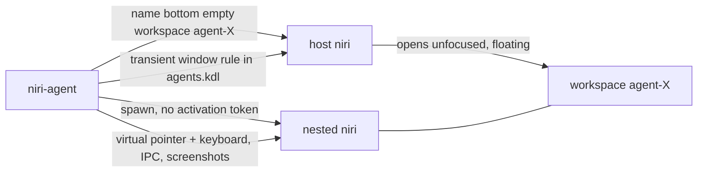

# niri-agent

Give AI agents their own desktops inside your [niri](https://github.com/niri-wm/niri) session.

Each agent session is a **nested niri** shown as one window on its own host workspace, `agent-<name>`. The agent launches apps, clicks, types and takes screenshots inside that nested compositor. Your focus, keyboard, pointer and workspace layout are never touched. To watch an agent, switch to its workspace.



## How it works

- **Workspace:** `start` names the bottom (always-empty) workspace of an output `agent-<name>` via IPC. Named workspaces persist while empty, and using the bottom one never shifts the indices of your own workspaces.
- **Placement without focus stealing:** niri window rules only come from config. `start` briefly appends a rule to `~/.config/niri/agents.kdl` (included from `config.kdl`) that sends the next nested-niri window to that workspace with `open-focused false`. It waits for niri's `ConfigLoaded` event, spawns the nested niri, then restores the file. The nested niri is started without `XDG_ACTIVATION_TOKEN` / `DESKTOP_STARTUP_ID`; with a token the window would grab focus despite the rule.
- **Input:** a small built-in Wayland client talks to the nested compositor's `zwlr_virtual_pointer_v1` and `zwp_virtual_keyboard_v1`. Keystrokes use a generated XKB keymap, so any Unicode text types correctly regardless of your layout. Since the protocols are bound on the nested display, nothing reaches your desktop. No `ydotool`, `wtype` or `grim` needed.
- **Screenshots:** the nested niri's own `screenshot-screen` IPC action. Screenshot pixels are the click coordinates.
- **Hidden-window stalls:** the host sends frame callbacks to windows on hidden workspaces only about once a second. The nested niri runs with `vblank_mode=0` (Mesa swap interval 0), so its event loop never blocks on those and input and IPC stay fast while you're not watching.

## Requirements

- niri 25.11 or newer (config `include`). Developed and tested on niri 26.04.
- Python 3.9+ (stdlib only), Linux.
- Mesa GPU drivers (the `vblank_mode=0` stall fix is Mesa-specific).
- Optional: `xwayland-satellite` for X11 apps inside sessions; `fuzzel` (or any dmenu-style launcher) for `niri-agent menu`.

## Install

From the repository checkout (`~/workspace/ai/niri-agent`):

```bash
./install.sh
```

`install.sh`:

- symlinks `niri-agent` into `~/.local/bin` (`$XDG_BIN_HOME`)
- copies `config/agents.kdl` to `~/.config/niri/agents.kdl` if missing
- appends `include "agents.kdl"` to the end of `~/.config/niri/config.kdl`, after a timestamped backup (`config.kdl.bak-niri-agent-*`). It must come last so the transient launch rule wins over your own rules.
- runs `niri validate`
- symlinks the agent skill into `~/.agents/skills/niri-agent` (override with `NIRI_AGENT_SKILLS_DIR`)

Uninstall (stops sessions, removes symlinks, `agents.kdl` and the include line):

```bash
./install.sh --uninstall
```

## Usage

```bash
niri-agent start                       # session "a1" on the focused output, 1280x800
niri-agent start web --size 1600x1000 --output DP-8

niri-agent run web -- firefox --new-instance --profile /tmp/agent-ff https://example.com
niri-agent screenshot web              # {"path": ".../shots/<ts>.png", "width": 1600, "height": 1000}
niri-agent click web 640 400           # --button left|right|middle, --double
niri-agent type web "hello, wörld"     # "-" reads stdin
niri-agent key web ctrl+l Return       # combos in order: shift ctrl alt super + key
niri-agent scroll web 640 400 5        # positive = down; --horizontal
niri-agent drag web 100 100 400 300
niri-agent move web 640 400
niri-agent msg web -- -j windows       # any `niri msg` command against the nested niri
niri-agent msg web -- action close-window --id 3

niri-agent list                        # sessions, alive flag, workspace, screen size
niri-agent show web                    # switch your view to agent-web
niri-agent stop web                    # closes all its apps, removes the workspace
niri-agent stop --all
```

All commands print JSON and exit 1 with a one-line message on error. Session state and screenshots live in `~/.local/state/niri-agent/sessions/<name>/`, and are deleted by `stop`.

`--size` is in host logical pixels. On a scaled monitor the nested screen is bigger: 800x600 on a 1.25× output gives a 1000x750 nested screen. `start` and `list` report the real screen size under `screen`.

Inside a session every window fills the screen (see `config/child.kdl`). For a human poking at it, the nested niri's Mod key is Alt: `Alt+Left/Right` switch windows, `Alt+Q` closes.

### Watching agents from your bar

Session workspaces are ordinary named workspaces (`agent-<name>`), so bar workspace widgets that show niri workspace names list them automatically. For a picker, bind the menu:

```kdl
binds {
    Mod+Shift+A { spawn "niri-agent" "menu"; }
}
```

`niri-agent menu --dmenu "rofi -dmenu"` uses a different launcher.

### Agent skill

`skill/niri-agent/SKILL.md` teaches an agent the workflow: start, run apps inside, screenshot, act, re-screenshot, stop. It also lists the rules that keep the agent off your desktop. `install.sh` links it into `~/.agents/skills`; point other harnesses at the same directory.

## Limitations

- A nested niri window always has app-id and title `niri`, so the launch rule matches any nested niri that opens during the ~2–3 s of `start`. Starts are serialized with a lock file, but a nested niri you open by hand in that window lands on the agent workspace.
- Keys go straight to the focused app in the session; they never trigger nested-niri keybindings. Use `niri-agent msg` for window management.
- Sessions have their own clipboard (the nested compositor's), separate from yours.
- If the nested niri crashes, `list` shows `"alive": false`; run `niri-agent stop <name>` to clean up.

## Development

```bash
PYTHONPATH=. python3 -m unittest discover -s tests
```
